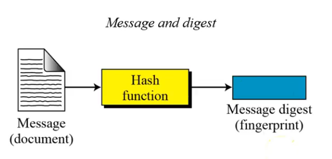
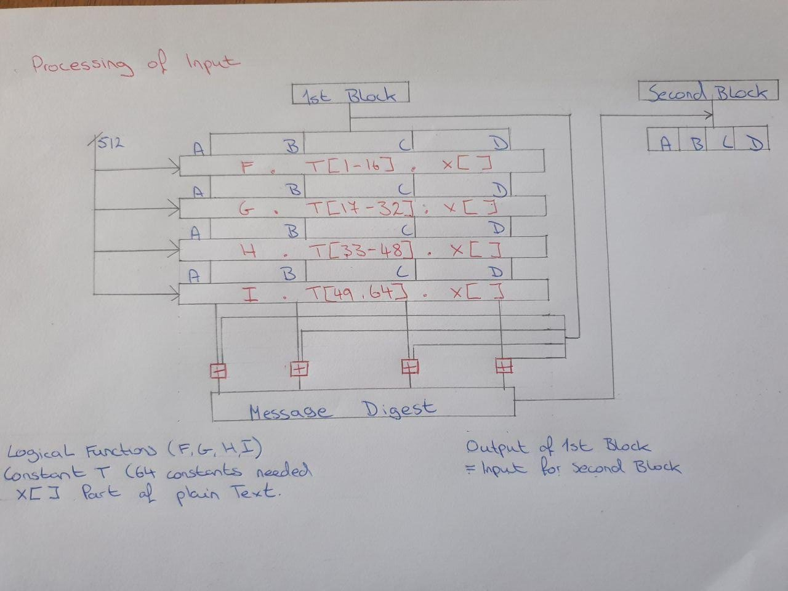

# <p align="center"> Theory of Algorithms Overview 
#### <p align="center"> Student name: Arkadiusz Mamala <br>Student Number: G0034088 
### <p align="center">Introduction 

<i> Theory of Algorithm project 2020 - Ian McLoughlin</i><br>
At the beginning of my second semester during my fourth academic year in the module Theory of Algorithms we were given a complicated task by the Lecturer Ian McLoughlin to complete.<br><br>
The task stated <br>
<i>You must write a program in the C programming language that calculates the MD5 hash digest of an input. The algorithm is specified in the Request For Comments 1321 document supplied by the Internet Engineering Task Force. The only pre-requisite is that your program performs the algorithm — you are free to decide what input the algorithm should be performed on. I suggest you allow the user to input some free text or a filename via the command line.</i><br>
<br>It was difficult for me to understand the assignment and have the knowledge on where to start on the problem given to us. I knew that it was the beginning of the semester and the reason for us studying this module is because it requires new theories and new algorithms for us to research and understand before we could start on any coding.<br>
<br>To the best of my knowledge, I believe that how most students felt at the start of the semester, I feel that's only right and it signifies that the module was given a lot of consideration a "module right for the students".
<br>
#### Repository
The repository contains two algorithms developed during this semester in this module. We had studied the sha256 and the Md5 algorithms. These two algorithms are very similar in a way and we find that out while coding up both of them and comparing them side by side.<br>
In the "Theory-of-Algorithms" directory contains a README .md file which describes to the visitors and users what the repository contains and how to deploy the algorithms present.<br><br>
The md5 folder consists of only the necessary files for the md5 algorithm.
<br> <b>md5.c - </b><br> This file consists of the code typed out using c programming language. The file is easy to follow with many comments inserted for any software developer to understand. The algorithm will be explained down below if the comments in the file aren't enough or certain parts of the algorithm are tougher to understand through code.

<b>TextToHash.txt - </b><br> This file is used for the user input or the testing input. It allows for different strings to get put through the md5 algorithm and receive a hash value for what is present in this file.

<b>README - </b><br> This is a short readme for the md5 algorithm which consists only of md5 processing information.

<b>Wiki file - </b><br>
The wiki file consists of the research carried out on this project and the md5 algorithm.

### <p align="center">Run

To run this project on any device the user need download the files onto their computer/device.
To get the project downloaded, the user can do this in two ways using the terminal or downloading the provided zip file.

#### ZIP Download
1. Move into the github link of this project
    + https://github.com/ArekMamala/Theory-of-algorithms
1. top right corner you need to click on "Clone or Download"
    + An option will then appear for the user to download the .zip folder

#### CLONE Repository 
1. For this to work your computer must have git installed 
+ link to download git <b>https://git-scm.com/downloads</b>
2. After git is installed.
1. Open up a terminal on the device that you decide to use.
+ CD into the chosen location on your computer
4. Type in the following command with the github repository link.
+ ``` 
  git clone https://github.com/ArekMamala/Theory-of-algorithms 
5. Once this is done project is present in that chosen directory.

#### Compiling
1. Open the terminal on your computer
1. Move into the md5 folder the directory where the github repository got extracted to. 
1. Use the command stated below to determine if you are in the correct directory.
+ ``` 
    dir

4. To compile the application enter the following command into the terminal.
+ ``` 
    gcc md5.c

5. This had compiled the c program and created a runnable file a.out
6. To run this program the command used in the terminal is 
+ ```
    ./a.out <command line argument> (--help) 

7. Depending on the command line argument entered the application will execute different options.


### <p align="center">Test

#### <p align="center">Test Cases for Command line Arguments
|Test Case   |      Test      |  Expected Result |  Pass/Fail
|:----------:|:-------------:|:------:|---------:|
| 1 |No argument | output to the user to enter an argument | PASS       |
| 2 |Too many Arhuments   |  Error output too many arguments  | PASS       |
| 3 | --help |    Help option is displayed to the user | PASS       |
| 4 | --test|    Tests are automatically carried out | PASS       |
| 5 | --userInput | User can enter a string which gets hashed  | PASS       |
| 6 | --resources |    Resources of the project are displayed  | PASS       |


#### <p align="center">Test Cases for String hasshing
|Test Case   |      Test      |  Expected Result |  Pass/Fail
|:----------:|:-------------:|:------:|---------:|
| 1 | "" | d41d8cd98f00b204e9800998ecf8427e | PASS|
| 2 | "a" | 0cc175b9c0f1b6a831c399e269772661 | PASS|
| 3 | "abc" | 900150983cd24fb0d6963f7d28e17f72  | PASS|
| 4 | "message digest" |    f96b697d7cb7938d525a2f31aaf161d0  | PASS|
| 5 | "abcdefghijklmnopqrstuvwxyz" |    c3fcd3d76192e4007dfb496cca67e13b  | PASS|
| 6 | "ABCDEFGHIJKLMNOPQRSTUVWXYZab<br>cdefghijklmnopqrstuvwxyz0123456789" |    d174ab98d277d9f5a5611c2c9f419d9f  | PASS|
| 7 | "123456789012345678901234567890123<br>45678901234567890123456789012345678901234567890" |    57edf4a22be3c955ac49da2e2107b67a  | PASS|

#### <p align="center">Testing the application

We start the testing of this application through compiling the program firstly. We need to enter the command stated above in the correct directory expecting no output in the terminal just a new executable file created in the project directory. If there are errors in the code the program will not compile and the application fails the initial testing.
<br>

This application is designed to take only one command line parameter when executing the file.
The following commands are accepted by the application.

* --help
* --test
* --userInput
* --resources

For each one of these parameters a different result should appear to the user. By testing each one of theses separately.
#### --help
When we add this command line parameter to running the project we expect firstly for the project not to crash and for it to accept the parameter "--help".
When --help is entered user should gain enough information about how to run the application so he/she would be able to run it correctly.

--help should output
+ Short description on what this application is designed to accomplish and its objectives.
+ A list of acceptable command line arguments and what they output.
+ The command to run the application 

#### --test
The --test command should also be accepted by the application without crashing.<br>

"--test" command was designed by me to automatically test the application with string inputs that were given out by the https://tools.ietf.org/html/rfc1321 website and compare the result with the expected result.
--test should output
+ The string its testing.
+ The result of that string hashed using the md5 application
+ Expected result from the https://tools.ietf.org/html/rfc1321 website for the following tests.

#### --userInput
This option was designed to let the user hash witch ever string they chose using the md5 algorithm. First and foremost, this command must be accepted in the application like the others without crashing.

--userInput should have the following outputs
+ A message asking a user to enter an input. 
+ The application should not continue until the user enters a string or empty string and presses enter to continue.
+ After the above step is done the String entered should be hashed and output should be printed out to the user.

#### --resources
This is the final command line parameters available to the user. It is described to the user more information on the project.

--resources should output 
+ Project repository link 
+ Readme .md file link
+ The reasearch link that was carried out fr this project.


#### Wrong command or no command
This should output to the user an error message and the acceptable commands for this project.


### <p align="center">Algorithm 

<p align="center"> 

<i><b>What is the MD5 algorithm ?</b><br>
The MD5 hash function was originally designed for use as a 
secure cryptographic hash algorithm for authenticating digital signatures
</i><br>

The <b>first step</b> in this algorithm is to append padding bits. We need to make the lenght of the file in bits to be 64bits less than a multiple of 512.

Padding is always performed even if the length of the message is 64bits less than multiple of 512.

A single "1" bit is appended to the message and then a "0" bits are appended so that the length of bits in the padded message becomes the correct necessary length of the message in bytes.

Ammount of bits appended is in the range from 1 to 512 at most.

The <b>second step</b> is to append the length by 64 bits.
A 64-bit representation of the message length is added to the outcome of step number one.<br>
After these 64 bits are added the message has a complete length that is a multiple of 512 bits.
This then gets divided into 16 different block size of 32-bit words.

The <b>third step</b> is the implementation step. initializing the MD buffer.<br>
A four word buffer <b>(A,B,C,D)</b> these are used to calculate the message digest they are each 32-bit words.
These registers are initialized to the following hexdecimal values.
+ A => 01234567
+ B => 89abcdef
+ C => fedcba98
+ D => 76543210
 

Message processing <b>step four</b> 16-word blocks are used for four functions that are defined such that each of the functions takes in an input  of three 32-bit words and produces a 32 bit word as an output.
+ F(x, y, z) (((x) & (y)) | ((~x) & (z)) 
+ G(x, y, z) (((x) & (z)) | ((y) & (~z)))
+ H(x, y, z) ((x) ^ (y) ^ (z))
+ I(x, y, z) ((y) ^ ((x) | (~z))) 

Each round consists of 16 steps 
+ ``` 
    a= b+((a+F(b,c,d)+M[i]+ T[k])<<<s)
+ a, b, c, d refer to the four words of the buffer in step three.
+ F(b, c, d) is a different nonlinear function for each round
+ ``` 
    NONLINEAR FUNCTIONS FOR EACH ROUND 

    #define FF(a, b, c, d, x, s, ac)                 
  {                                              
    (a) += F((b), (c), (d)) + (x) + (ac); 
    (a) = ROTATE_LEFT((a), (s));                 
    (a) += (b);                                  
  }
    #define GG(a, b, c, d, x, s, ac)                 
  {                                              
    (a) += G((b), (c), (d)) + (x) + ac; 
    (a) = ROTATE_LEFT((a), (s));                 
    (a) += (b);                                  
  }
    #define HH(a, b, c, d, x, s, ac)                
  {                                              
    (a) += H((b), (c), (d)) + (x) + ac; 
    (a) = ROTATE_LEFT((a), (s));                 
    (a) += (b);                                  
  }
    #define II(a, b, c, d, x, s, ac)                 
  {                                              
    (a) += I((b), (c), (d)) + (x) + ac; 
    (a) = ROTATE_LEFT((a), (s));                 
    (a) += (b);                                  
  }
  ```

#### <p align="center"> Here is a drawing representation of md5 message processing
<p align="center"> 


### <p align="center">Complexity 

#### <p align="center"> Comlpexity of my developed Algorithm
At the initial state of the program is accepting the command prompt arguments. The application has four outcomes when it comes to accepting the command prompt arguments.

Two of these arguments runs the hash algorithm and test its working the remaining two are more of a helping hand to the user to receive the correct required arguments.

The application has given out the ability to read in the users' custom text to be hashed using this algorithm but has also automatic tests added to its workings.

To understand how this work, please look at the run section of the overview where all the command line arguments are explained in detail.

####  What the code consists off

First off we have the Constants for MD5Transform routine these are used in the FF, GG, HH, II functions. Following these constraints, we have the 65 pre-defined hash values which also get called in the FF, GG, HH, II values.

Following by a union block with three vars a uint64_t, uint32_t and a uint8_t.

After these constants are defined the basic md5 functions are created 
F, G, H, I.
Once we have these defined we are able to create the FF, GG, HH and II transformations for each one of these four rounds in the md5_hash function.

We then move into the nextblock functions which takes in the union block, FILE, uint64_t and an enum flag with its status.

This function goes through if statements.
First one checks if the status is equal to finish if it is returning zero.
Then, if the status pointer is PAD0 we then need an all-padding block without the 1 bit. Change the status to FINISH and return 1.

After this if statement, we check if we can fit all the padding in the last block at the end of this if statement change status to PAD0 and return 1.

If none of these if statements come into play we have read between including 56 and excluding 64 bytes. We then go through a for loop change status to PAD0 and return one.

Below that function in the program, we have the md5_hash function which takes in a pointer of a union block and a uint32_t. 

Creates four uint32_t "a, b, c, d" we equal them to the hash values passed in when the function is called. We then use the four transformations each one 16 times as it equals to 64 at the end.

Each transformation is called 16 times starting with 
1. FF
2. GG
3. HH
4. II <br>

Through these functions we pass the a, b, c ,d the thretwo of union block the constants defined at the top and the 64 pre-defined hash values.

At the end of the function each hash value passed in is equal to itself plus the value of a, b, c, or d depending which hash it is.

Next function that is present after this one is hashTheFile function it opens a file that is used for hashing strings. If the file is not available to open an error message is printed out to the user.

After this is done, we create variables necessary for us to run the functions created above.

We create a while loop where we call the nextBlock function and variables we created necessary for this function.

In that while loop execute the md5_hash function. This gets the file reads through it and hashes the file. We then print out the hashed value to the user and close the file.

Next function present in this program is the writeToFile function where chars are passed and we print to the file the text that is passed through the function.

The main method is the last method in the program and mostly here we deal with command line arguments depending on arguments different result must be present.

We have an if statement for the amount of arguments that are present in while running the program.
If the amount of arguments is wrong error with extra information is printed out. 

When the argument is equal to "--test" different strings are automatically written to a file and that file is hashed giving out the result and expected result.

If the argument is equal to "--userInput" the user has the ability to enter a string of characters which get output to a file that then gets hashed and the result is printed to the user.

Other command line arguments such as s "--help" and "--resources" printout the help and project information to the user.

This is the complexity of the md5 algorithm researched coded compiled and tested by Arkadiusz Mamala Gmit student- G00349088

#### <p align="center"> Insight on md5 

|Keys for comparison   |     MD5      |  SHA |
|:----------:|:-------------:|:------:|
| Security |Less secure than SHA | High secure than MD5  |
| Message Digest Length |128 Bits |  160 bits| 
| Attacks required to find out Original Message | 2^128 bit operations required to break |2^160 operations required to break  | 
| Speed | Faster only 64 iterations |Slower requires 80 iterations |
| Successful attacks so far |Attacks reported to some extents |No such attacks reported yet  | 


MD5 algorithm is it reliable, is it still in use currently can it be broken ? 
<br>These are some of the questions we ask ourselves when we discuss different hashing algorithms and compare them.
There are many hashing algorithms out there on the web divided in opinions some are better and more secure than others. 


Over a quarter of all the major content management systems (CMSs) use the old and outdated MD5 hashing scheme as the default for securing and storing user passwords.

The md5 algorithm is known to be broken, there have been techniques developed create the same hash using arbitrary input. Also, GPUs are powerful enough to brute force passwords.
I will get into more detail about these techniques, but first off. What can we use the md5 algorithm for is there still use for it?

The MD5 algorithm is still heavily used by many organizations and businesses.
Althought this is true the MD5 algorithm should not be used for cryptography but there is many tasks that this algorithm can simplify for the people and systems.
This algorithm can be used for a fast image or string comparison.

MD5 is prefered over other algorithms if you're forced to generate many digests.
Md5 algorithm is faster which is one of its main strengths against the other algorithms.

#### <p align="center"> Reversing the algorithm 

The MD5 algorithm cannot be reverse engineered it is impossible so far.
The algorithm is irreversible. It changes any length of the string form size of a multiple of 512 to a total size of 128bits.

<b>Here is a simple example of this theory proven right</b>
+ 15 Mod 4 = 3
+ Formula: x Mod 4
+ you can't deduce x as it could be 3, 7, 11, 15 etc...

As we can see above putting 15 in as x will always give us the answer of 3 but there is no way to deduce the original number.

It's obvious that these algorithms are much more complex and much difficult to understand. 

<b>Is there any ways around it how do we figure out these hashes ?</b>

In 2010 the MD5 algorithm was declared as “cryptographically broken and unsuitable for further use.” by the CMU Software Engineering Institute.
The MD5 algorithm is said to have a few weeknesses 
+ its possible to find a collision 
+ because some string and passwords are usually short and people often use common values 
  + if the password is common, such as "password" 
  + therefore you can sometimes make a reasonably good guess at someones password.

<b>Hash collision</b><br>
 The hash collision attack is an aim to find two files or strings with the same hash function to produce same hash outcome.
 Collision attacks the odds are very low, especially for functions with very large output sizes

 How do we find what a certain hashcode represents. We can simply use a google search for an MD5 hashdecoder. 
 These decoders are not very reliable the way that these decoders work is.
 + They have a large database with md5 hash values.
 + You enter the string that you have hashed and result pops up.
 + This is done by comparing the hash entered againts their large database. 

This is the only way that we can decode these hash values by comparing them to already existent. 

### <p align="center">References 

https://github.com/adam-p/markdown-here/wiki/Markdown-Cheatsheet<br>
This referece was used in the styling of this document.

https://help.github.com/en/github/creating-cloning-and-archiving-repositories/cloning-a-repository 
<br>This referece was used for the run part of this document.

https://git-scm.com/downloads
<br>This referece was used for the run part of this document.

https://rupinderjeetkaur.wordpress.com/2014/06/20/run-a-cc-program-on-terminal-using-gcc-compiler/
<br>This referece was used for the compiling and deploying part of this document.

https://www.youtube.com/watch?v=-uRpRMpvdm0
<br>This referece helped me to undersytand the algorithm used in algorithm section.

https://stackoverflow.com/questions/2948156/algorithm-complexity-security-md5-or-sha1
<br>This referece was used for the complexity secition.

https://www.youtube.com/watch?v=53O9J2J5i14
<br>This referece helped me to undersytand the algorithm used in algorithm section.

https://www.zdnet.com/article/a-quarter-of-major-cmss-use-outdated-md5-as-the-default-password-hashing-scheme/
<br>This referece was used for the complexity secition.

https://www.johndcook.com/blog/2019/01/24/reversing-an-md5-hash/
<br>This referece was used for the complexity secition.

https://stackoverflow.com/questions/25753741/why-cant-md5-be-reverse-engineered
<br>This referece was used for the complexity secition.

https://privacycanada.net/hash-functions/hash-collision-attack/
<br>This referece was used for the complexity secition.
